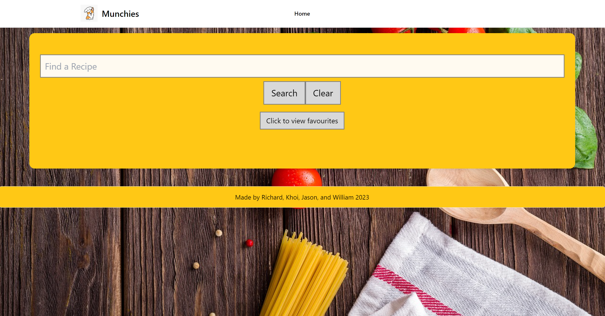
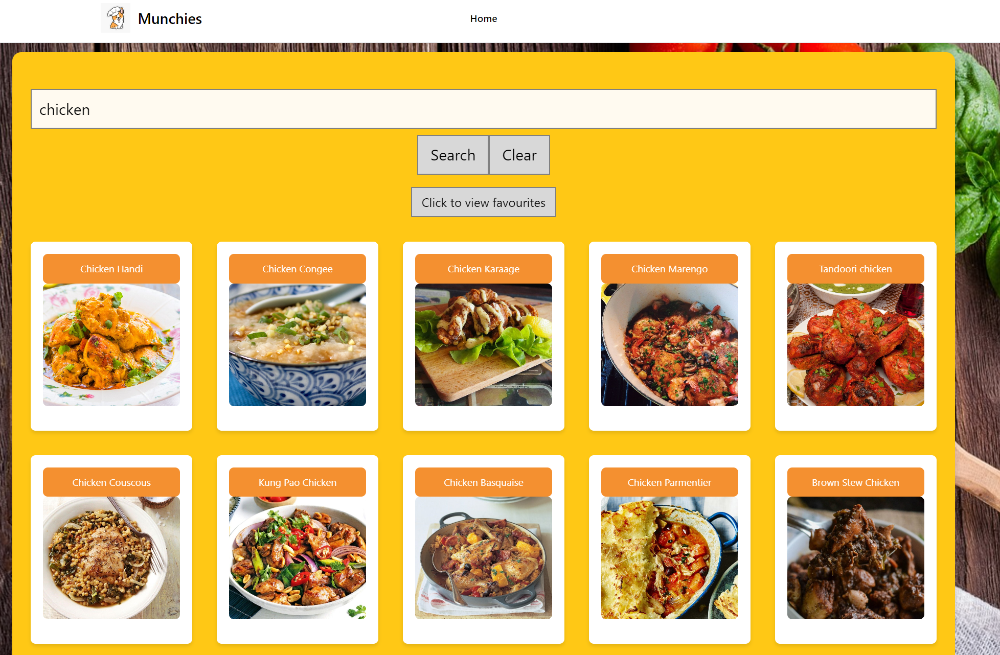
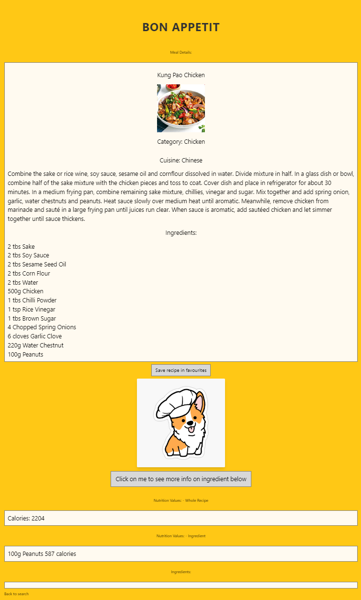

# Munchies Recipe finder 

## Table of Contents

- [Description](#description)
- [Deployment](#deployment)
- [Application Quality](#application-quality)
- [License](#license)
- [Screenshot](#screenshot)

## Description

Munchies is a web application designed to help users discover recipes based on specific ingredients. It provides a user-friendly interface to ensure users can get the best out of the ingredients they have on hand. The primary goal is to make meal planning more efficient and reduce food wastage by utilizing available ingredients.

## Deployment

- Live URL: [https://willxluong.github.io/CodeQuiz/]
- GitHub Repository: [https://github.com/WillxLuong/CodeQuiz]

## Application Quality

- The application provides a seamless and intuitive user experience.
- The design is modern and polished, offering users an engaging platform to find recipes.
- The functionality enables users to search for recipes based on ingredients, view relevant recipes, and apply dietary filters.

## License

This project is licensed under the [MIT License](LICENSE).

## Screenshot

